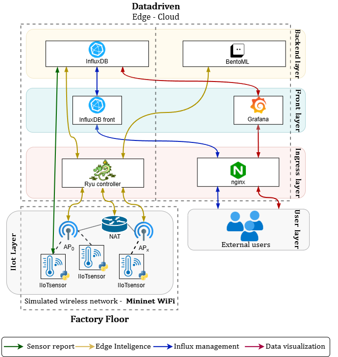

# Softwarized Data-Driven Architecture for Edge Computing IIoT Environments

This repository contains the implementation and supporting materials of a **softwarized, data-driven architecture** for **Industrial Internet of Things (IIoT)** environments. The architecture has been designed to operate seamlessly across the **Cloud/Edge/IIoT continuum**, enabling low-latency analytics, distributed intelligence, and adaptive reconfiguration based on real-time telemetry.

## 🏗️ System Overview

The following diagram provides an overview of the main components and data flow across the architecture:

<p align="center">
  
</p>

This design integrates containerized microservices, AI-driven inference modules, and software-defined networking (SDN) controllers to support **dynamic adaptation**, **federated learning**, and **real-time decision-making** within IIoT ecosystems.

---

## 📚 How to Cite

If you use this repository, architecture, or experimental setup in your research, please cite the following works:

### **Journal Article (Applied Sciences, 2025)**

> D. Carrascal, J. Díaz-Fuentes, N. Manso, D. Lopez-Pajares, E. Rojas, M. Savi, and J. M. Arco,  
> “Softwarized Edge Intelligence for Advanced IIoT Ecosystems: A Data-Driven Architecture Across the Cloud/Edge Continuum,”  
> *Applied Sciences*, vol. 15, no. 19, p. 10829, 2025. [https://www.mdpi.com/journal/applsci](https://www.mdpi.com/journal/applsci)

```bibtex
@article{carrascal2025softwarized,
  title={Softwarized Edge Intelligence for Advanced IIoT Ecosystems: A Data-Driven Architecture Across the Cloud/Edge Continuum},
  author={Carrascal, David and D{\'\i}az-Fuentes, Javier and Manso, Nicolas and Lopez-Pajares, Diego and Rojas, Elisa and Savi, Marco and Arco, Jose M},
  journal={Applied Sciences},
  volume={15},
  number={19},
  pages={10829},
  year={2025},
  publisher={MDPI}
}
```

### Conference Paper (ICIN 2025)

> D. Carrascal, E. Rojas, D. Lopez-Pajares, N. Manso, J. Alvarez-Horcajo, and I. Martinez-Yelmo,
> “Softwarized Data-Driven Architecture for Edge Computing IIoT Environments: A Proof of Concept,”
> in Proc. 28th Conference on Innovation in Clouds, Internet and Networks (ICIN), 2025, pp. 64–68. IEEE Xplore

```bibtex
@inproceedings{carrascal2025softwarized,
  title={Softwarized Data-Driven Architecture for Edge Computing IIoT Environments: A Proof of Concept},
  author={Carrascal, David and Rojas, Elisa and Lopez-Pajares, Diego and Manso, Nicolas and Alvarez-Horcajo, Joaquin and Martinez-Yelmo, Isaias},
  booktitle={2025 28th Conference on Innovation in Clouds, Internet and Networks (ICIN)},
  pages={64--68},
  year={2025},
  organization={IEEE}
}
```

## 🔗 Related Work

This repository extends the open proof of concept originally presented in the ICIN 2025 conference paper, integrating advanced orchestration, ML-based inference, and scalable deployment strategies as described in the Applied Sciences journal version.

© 2025 Universidad de Alcalá – Networks and Intelligent Systems (NetIS-UAH)
